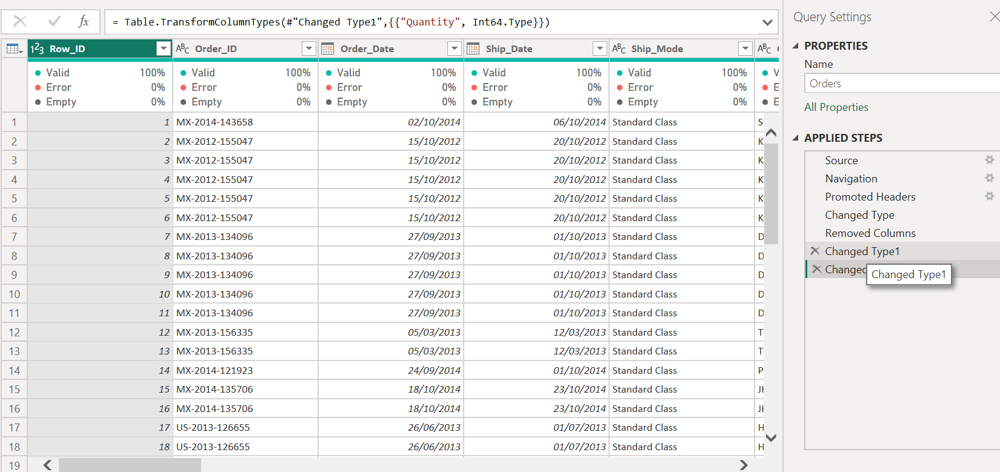
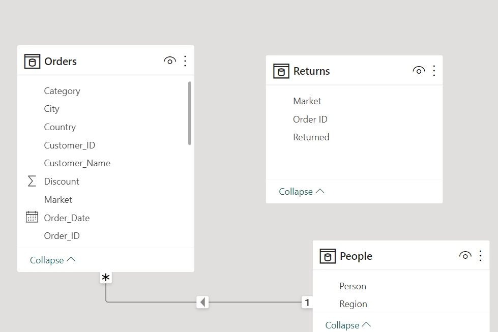
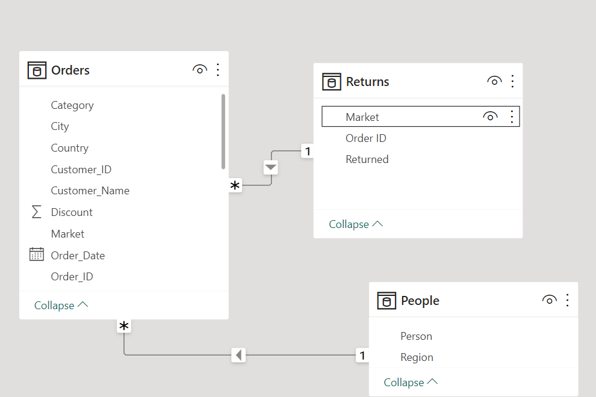
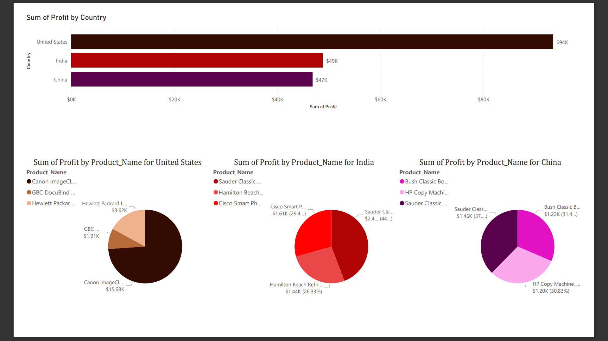
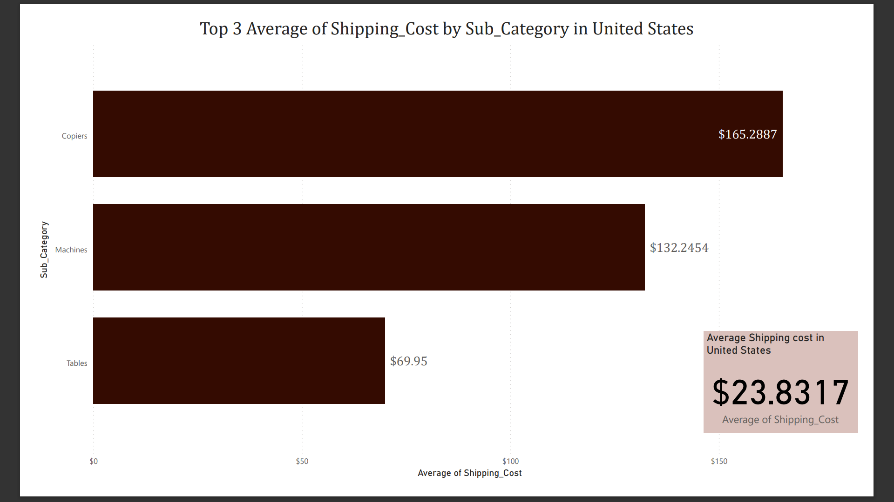
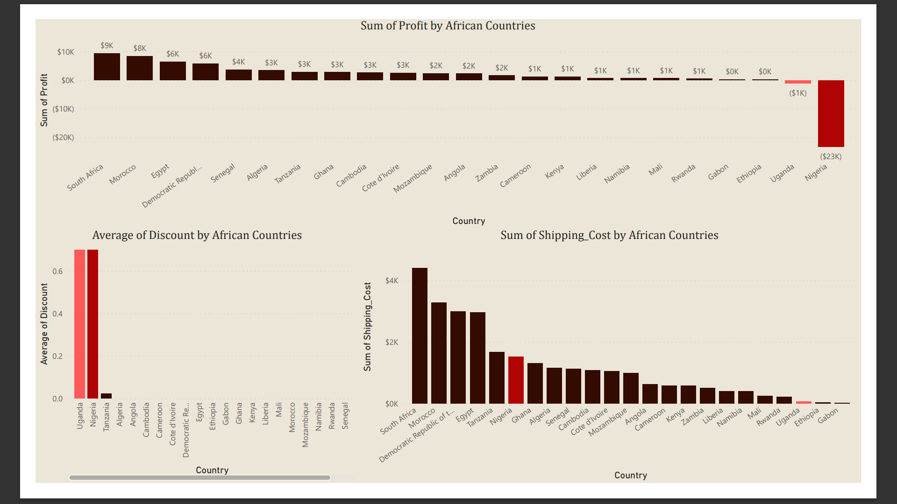
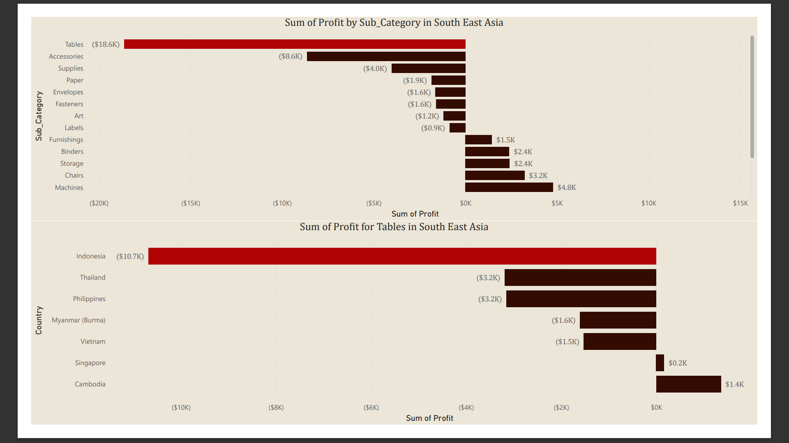
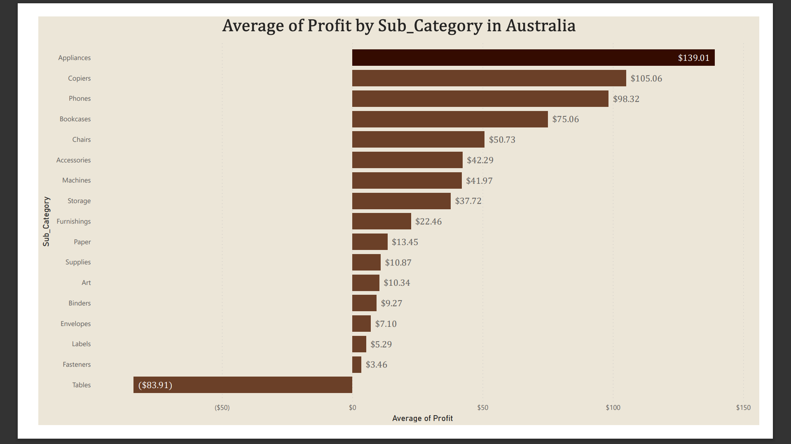
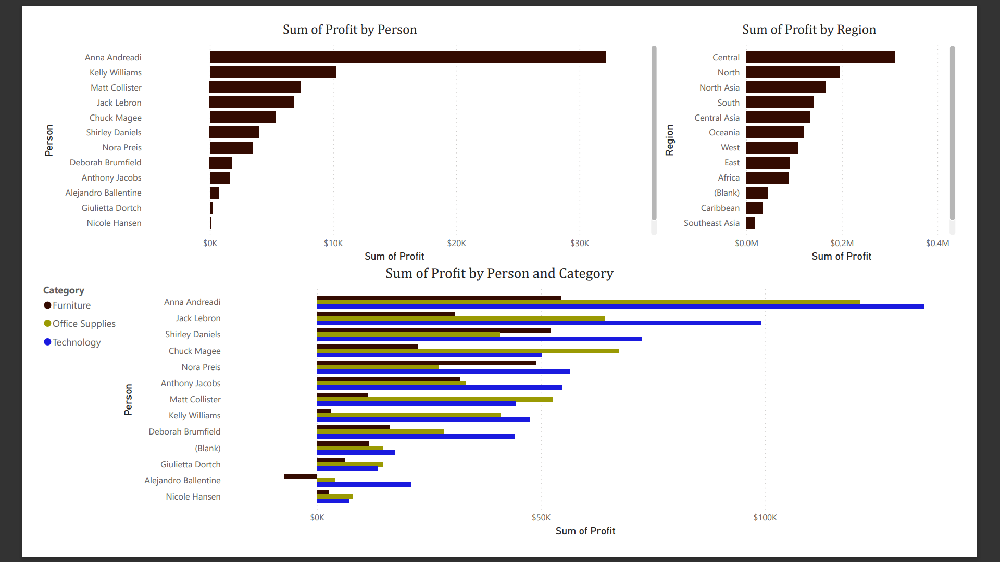

# Global-superstore-Capstone-Project

 _Image by vecstock_
***
## Introduction
Global Superstore is a global online retailer based in New York, boasting a broad product catalog and aiming to be a one-stop-shop for its customers. Global The superstore’s clientele, hailing from 147 different countries, can browse through an endless offering with more than 10,000 products. This large selection comprises three main categories: office supplies (e.g., staples), furniture (e.g., chairs), and technology (e.g., smartphones).

_This analyses is in fulfilment of **[Digateley Drive](https://www.linkedin.com/company/digitaley-drive.ng/)** Capstone project for Cohort 7.0_

## Problem Statement
1. a) What are the three countries that generated the highest total profit for Global Superstore in 2014? b) For each of these three countries, find the three products with the highest total profit. Specifically, what are the products’ names and the total profit for each product? 
2.  Identify the 3 subcategories with the highest average shipping cost in the United States. 
3.  Assess Nigeria’s profitability (i.e., total profit) for 2014. How does it compare to other African countries? 
   b) What factors might be responsible for Nigeria’s poor performance? You might want to investigate shipping costs and the average discount as potential root causes.
4. a) Identify the product subcategory that is the least profitable in Southeast Asia. Note: For this question, assume that Southeast Asia comprises Cambodia, Indonesia, Malaysia, Myanmar (Burma), the Philippines, Singapore, Thailand, and Vietnam.
   b) Is there a specific country i n Southeast Asia where Global Superstore should stop offering the subcategory identified in 4a?
5. a) Which city is the least profitable (in terms of average profit) in the United States? For this analysis, discard the cities with less than 10 Orders.
   b) Why is this city’s average profit so low?
6. Which product subcategory has the highest average profit in Australia?
7.  Who are the most valuable customers and what do they purchase?

## Data Sourcing
This dataset was provided by [Digitaley Drive](https://www.linkedin.com/company/digitaley-drive.ng/) as an Excel file. It contains three (3) sheets.
- ORDERS sheet contains 51291 rows and 24 columns,
- PEOPLES sheet contains ,
- RETURNS sheet contains 1173 rows and 3 columns.

## Skills/ Concepts exhibited
The following POWERBI concepts were incorporated
-	Knowledge of Generating Actionable Insights,
-	DAX concepts: Custom columns, Calculated Column, year(),Convert(),
- Filters,
-	Power Query,
-	Data Modeling,
-	Data Cleaning,
-	Data Visualization.

## Data Transformation/ Cleaning
-	The column “Postal_code” was deleted from the ORDERS table because it contained only null values.
-	The data types for “Sales”, “Quantity”, “Profit”, “Shipping_cost” was changed from whole number to Currency (Fixed decimal number) in ORDERS table.
-	Used first row as headers for PEOPLES  and RETURNS table.
-	 Filtered rows to remove Empty rows for PEOPLES table.
-	Created a column “Order_Year” in ORDERS table using year().
-	Removed duplicate of “Order_id” in RETURNS table leaving 1172 row from initial 1173 rows.
-	Created a column “Delivery_time” in orders table using “Delivery_time = CONVERT(Orders[Ship_Date]-Orders[Order_Date],INTEGER)”.

## Data Modelling
 Auto Model                      | Adjusted Model           
:-------------------------------:|:-------------------------------:
         |         

A star Schema model was automatically created Power BI and is adjusted to include new relationships. The order table is the fact table of the model. Peoples and Returns table is the dimensional table of the model and are connected to the table by the columns “Region” and “Order_id” respectively.

## Data Analysis and Visuals
 The visuals contains Seven(7) pages:
 1. Countries with the highest Profit in 2014
 2. Top 3 subcategories by average shipping cost in US
 3. Nigeria's Profitability in comparison to other African Countries in 2014
 4. Subcategories by profitability in South East Asia
 5. Cities by Profitability in US
 6. Subcategories by highest average profit in Australia
 7. Most Valuable Customers

You can interact with this report [here](https://docs.google.com/spreadsheets/d/1nxESpFzWjlGDMGDVLH69xmDzIl9l6OEq/edit?usp=drive_link&ouid=115905354430055550269&rtpof=true&sd=true)
***
## Insights Generated and Recommendations
### Countries with the highest Profit in 2014 

The three countries with highest total profit for Global superstore in 2014 are United States, India, China.
***
### Top 3 subcategories by average shipping cost in US

Copiers, Machines and Tables are the subcategories with the highest average shipping cost in the United States.
***
###  Nigeria's Profitability in comparison to other African Countries in 2014

Nigeria had a total loss of about -$23,285 in comparison with other African countries, this loss was due to the High Shipping Cost and its elevated discount. I compared this value with Uganda which also had the same discount rate at an average of 0.7, and i noted that while it ran at loss this was cushioned by its reduced shipping cost.

_**Recommendations:** A reduced discount rate will cushion the high cost of shipping and considerably reduces loss._
***
### Subcategories by profitability in South East Asia 

Tables generated the least Profit in South east Asia.Indonesia accumulated the greatest loss from the sales of Tables, it recorded over 300% more loss than Thailand which succeeds it in the scale of loss.

-**Recommendations:** Tables should not be marketed in Indonesia until further analysis can be conducted to rectify the loss margin.
***
###  Cities by Profitability in US

Lancaster is the least profitable city in the United states this is because while the Discount rate and cost of shipping increases, the Sales also increases therefore reducing the profit margin.
***

### Subcategories by highest average profit in Australia

In Australia, the product subcategory with the highest Average is Appliances.
***

### Most Valuable Customers

Global stores most valuable customer is **Anna Andreadi** from Central region and made the most  purchase of products in the category: Technology.
***

### Conclusion
- Analysis on reduction of shipping cost should be conducted with the help of datasets from previous years to increase the profit margin.
- The average discount rate should be reduced in countries with high shipping costs to increase profits and In countries with low sales and low shipping cost,It should be increased.
- For a more in depth Analyses of **Global Superstore** data sets from previous years will be required for evaluation and data driven decision making.

